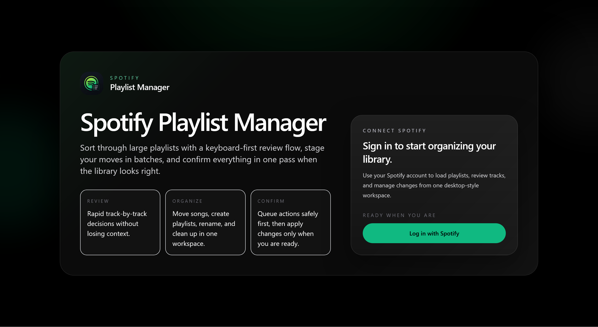
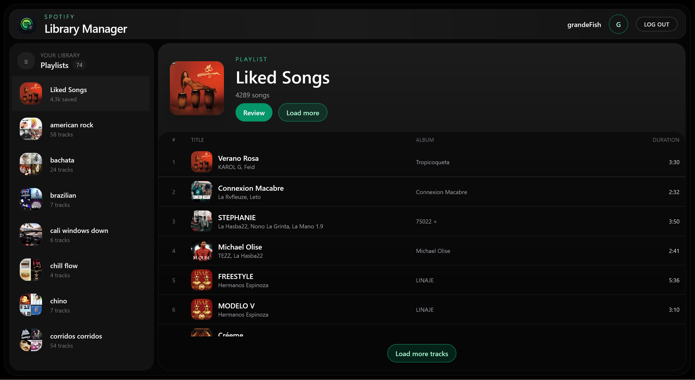
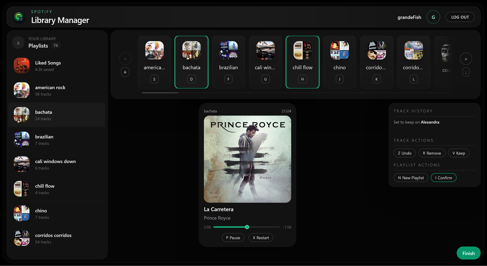
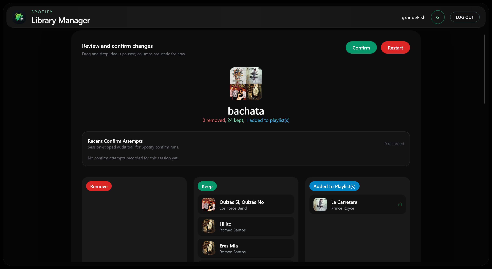

# Spotify Playlist Manager

Keyboard-centric playlist triage for power users with large Spotify libraries.

---

## Screenshots

  

<table>
  <tr>
    <td align="center">
      
       
      <strong>Homepage</strong>
    </td>
    <td align="center">
      
       
      <strong>Review Session</strong>
    </td>
    <td align="center">
      
       
      <strong>Confirmation Page</strong>
    </td>
  </tr>
</table>

---

## Project Summary

Spotify Playlist Manager is a full-stack web application for reviewing large Spotify playlists, deciding what to keep or remove, routing tracks into other playlists, and applying those changes in one confirm step instead of mutating a playlist one track at a time.

The app is built around a three-stage workflow:

- view a playlist and load tracks
- review tracks with keyboard-first controls
- confirm a batch of changes with progress, retries, and reconciliation

---

## Why This App Was Created

Spotify makes it easy to collect music, but once a library gets large, cleanup becomes slow and repetitive. Editing playlist-by-playlist directly in the Spotify client is workable for small changes, but it becomes inefficient when you want to make a long sequence of decisions across dozens or hundreds of tracks.

---

## How It Was Accomplished

The app was designed as a stateful workflow rather than a simple playlist viewer. Instead of applying Spotify mutations immediately, it persists review state, stores track decisions, collects add-to-playlist targets, and then executes the final Spotify writes through a confirm pipeline.

Key implementation ideas:

- a viewer mode for browsing playlists and loading tracks incrementally
- a review mode with hotkeys, playback controls, undo support, and playlist-target selection
- resumable review sessions stored in Prisma/Postgres so in-progress work can be recovered
- a confirm flow that batches Spotify writes in chunks, reports progress, records confirm attempts, and supports retrying failed work
- post-confirm reconciliation that re-fetches Spotify data and compares the refreshed totals with the expected result

That structure makes the project more than a UI wrapper around the Spotify API. It is a workflow-focused product with persistence, mutation orchestration, and failure-aware behavior.

---

## Tech Stack

- Next.js App Router + React 19 + TypeScript
- Tailwind CSS for styling primitives
- Prisma ORM + PostgreSQL for persistence
- ESLint (Next.js presets + Prettier) & Prettier formatting
- Husky pre-commit hook

---

## Current Capabilities

- left library rail with `Liked Songs` and full playlist browsing
- playlist viewer with metadata and incremental track loading
- review stage with keyboard-driven keep/remove/add actions
- creation of new target playlists during review
- resumable review sessions backed by the database
- summary and confirm flow with real Spotify writes
- partial-failure handling and retry support
- confirm-attempt history and post-confirm reconciliation

---

## Future Plans

The next stage of the project is focused on making it stronger as a polished portfolio piece and a better product overall.

Upcoming priorities:

- improve review progress visibility and trust during the review phase
- continue refining playback and keyboard interactions
- add a dedicated session/review history view
- expand cleanup insights and reconciliation reporting
- prep app environment for production (support users)
